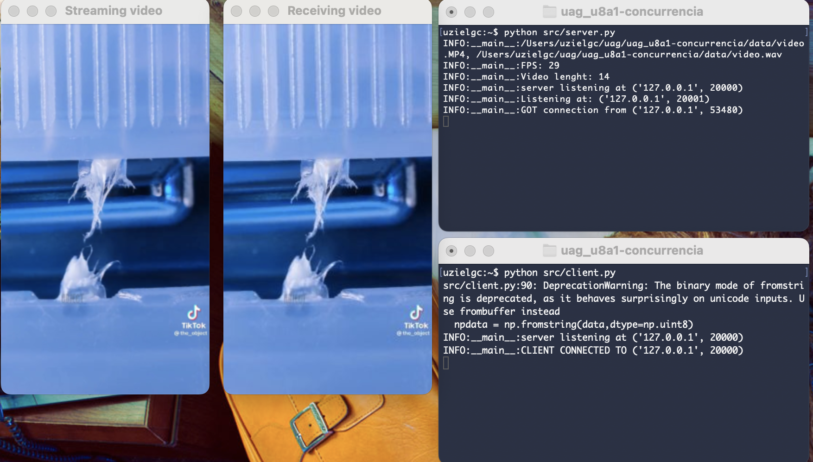

## U7 A1: Envío de archivos

### Author: Eloy Uziel García Cisneros (eloy.garcia@edu.uag.mx)
#### Repo: https://github.com/uzielgc/uag_u8a1-concurrencia

## Documentación

```
src/
  |-- client.py
  |__ server.py
```

Python app para stremear video y audio utilizando sockets UDP/TCP.

Al iniciar el servidor este espera por conexión antes de enviar el archivo (disponible en la carpeta [data](data)), una vez conectado conmienza el envio de video y audio en streaming.

Se utilizan hilos separados para vide y audio. El hilo de audio corre como daemon en la funcion `audio_stream`.

### Dependencias

ffmpeg

opencv-python
numpy
pyaudio

El código fuente se encuentra en la carpeta [src](src).

La evidencia en imagenes y/o video se encuentra en la carpeta [media](media).

El código esta comentado en los puntos clave del proceso.

*NOTA: Dependiendo del sistema opertivo quizá sea necesario incrementar el tamaño del datagrma UDP a `65535`


### How to Run


```
python src/server.py 
python src/client.py 
```

*NOTA: instalar los requerimientos previo a ejecución:
```
pip install -r requirements.txt
```

[](media/stream.mov "Video Demo")

* Click en la imagen para ir al video demo. (media/stream.mov)^

### Output:

Terminal 1:

```
uzielgc:~$ python src/server.py
INFO:__main__:/Users/uzielgc/uag/uag_u8a1-concurrencia/data/video.MP4, /Users/uzielgc/uag/uag_u8a1-concurrencia/data/video.wav
INFO:__main__:FPS: 29
INFO:__main__:Video lenght: 14
INFO:__main__:server listening at ('127.0.0.1', 20000)
INFO:__main__:Listening at: ('127.0.0.1', 20001)
INFO:__main__:GOT connection from ('127.0.0.1', 53480)
```


Terminal 2:
```
uzielgc:~$ python src/client.py
src/client.py:90: DeprecationWarning: The binary mode of fromstring is deprecated, as it behaves surprisingly on unicode inputs. Use frombuffer instead
  npdata = np.fromstring(data,dtype=np.uint8)
INFO:__main__:server listening at ('127.0.0.1', 20000)
INFO:__main__:CLIENT CONNECTED TO ('127.0.0.1', 20000)
uzielgc:~$ 
```

